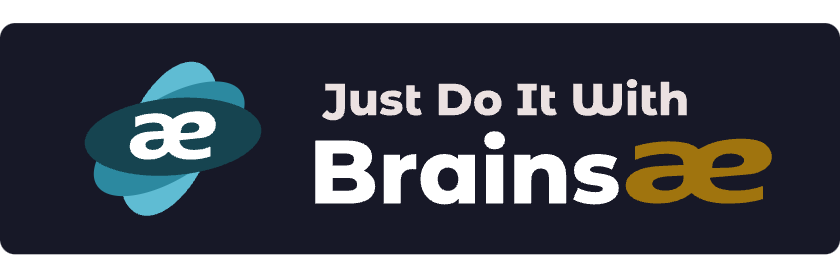

### Hi there 👋

<!--
**Brainsae/brainsae** is a ✨ _special_ ✨ repository because its `README.md` (this file) appears on your GitHub profile.

Here are some ideas to get you started:

- 🔭 I’m currently working on ...
- 🌱 I’m currently learning ...
- 👯 I’m looking to collaborate on ...
- 🤔 I’m looking for help with ...
- 💬 Ask me about ...
- 📫 How to reach me: ...
- 😄 Pronouns: ...
- ⚡ Fun fact: ...
-->

[![GitHub release][release-img]][release]
[![License][license-img]][license]
[![Go version][shield-go-version]][go-version]
![Downloads][download]

### About Brainsae

### Quick Start

[release-img]: https://img.shields.io/github/release/brainsae/brainsae.svg
[release]: https://github.com/brainsae/brainsae/releases

[license-img]: https://img.shields.io/github/license/brainsae/brainsae.svg
[license]: https://github.com/brainsae/brainsae/blob/master/LICENSE

[shield-go-version]: https://img.shields.io/github/go-mod/go-version/brainsae/brainsae
[go-version]: https://github.com/brainsae/brainsae/blob/main/go.mod

[download]: https://img.shields.io/github/downloads/braineae/brainsae/total?logo=github
