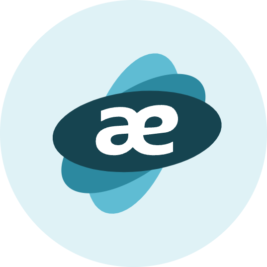

[![GitHub release][release-img]][release]
[![License][license-img]][license]
[![Go version][shield-go-version]][go-version]
![Downloads][download]

## Overview

Brainsae is a command line tool that implement kubelet's API.
Part of kubelet's API is documented but most of it is not.
This tool covers all the documented and undocumented APIs.
The full list of all kubelet's API can be viewed through the tool or this API table.
A related blog post:

## What can it do?

## Usage

[release-img]: https://img.shields.io/github/release/brainsae/brainsae.svg
[release]: https://github.com/brainsae/brainsae/releases

[license-img]: https://img.shields.io/github/license/brainsae/brainsae.svg
[license]: https://github.com/brainsae/brainsae/blob/master/LICENSE

[shield-go-version]: https://img.shields.io/github/go-mod/go-version/brainsae/brainsae
[go-version]: https://github.com/brainsae/brainsae/blob/main/go.mod

[download]: https://img.shields.io/github/downloads/braineae/brainsae/total?logo=github
